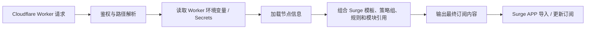

# AtlasRouter

AtlasRouter 是一个围绕 Surge APP 组织的代理分流套件仓库，目标是把分流规则、脚本、模块和订阅生成逻辑放在同一个可维护的工程里。

订阅服务计划部署在 Cloudflare Workers 上。节点信息不写入仓库，而是通过 Cloudflare Worker 的环境变量或 Secrets 注入；Worker 再结合本仓库维护的规则与策略，生成 Surge 可订阅的最终配置。

## 当前状态

仓库仍处于初始化阶段。

- `README.md`：项目说明与维护入口。
- `AGENTS.md`：面向后续 LLM/Agent 协作者的仓库工作规范。
- `docs/`：设计、部署、运维和决策记录。
- `references/`：历史配置和样例，仅用于理解已有想法，不作为事实来源或实现依据。

## 目标组成

后续实现可以按下面的职责拆分，具体目录以实际代码为准：

- `worker/`：Cloudflare Worker 订阅入口、鉴权、节点注入、配置渲染。
- `surge/`：Surge 主配置模板与策略组定义。
- `rules/`：自维护分流规则、规则集入口、第三方规则引用说明。
- `modules/`：Surge `.sgmodule` 模块。
- `scripts/`：Surge 脚本与相关说明。
- `docs/`：架构说明、部署流程、配置约定和变更决策。
- `references/`：非权威参考材料，避免被生产逻辑直接依赖。

## 订阅生成流程

## 维护原则

1. 节点、Token、上游订阅链接等敏感信息不提交到 Git。
2. `references/` 中的内容只能帮助理解方向；实现前以仓库代码、当前需求和官方文档为准。
3. Surge 规则保持可解释的顺序：越具体的规则越靠前，兜底规则放最后。
4. Worker 中的订阅鉴权、路径分发和错误响应要保持简单明确。
5. 新增规则、策略组或模块时，同步更新说明，避免配置和文档漂移。

## Cloudflare Worker 配置约定

实际变量名由 Worker 实现决定，但应遵守以下边界：

- 敏感值使用 Cloudflare Secrets 或等价安全机制。
- 非敏感配置可以使用 Worker 环境变量。
- 本地开发时不要提交 `.dev.vars*`、`.env*` 或任何真实节点信息。
- Worker 代码应从 `fetch(request, env, ctx)` 的 `env` 参数读取绑定，避免硬编码。

## Surge 配置约定

- `[Proxy Group]` 负责策略组合，例如手动选择、自动测速、故障切换和区域筛选。
- `[Rule]` 负责流量匹配，规则按文件顺序从上到下匹配，并以 `FINAL` 规则兜底。
- 外部策略可通过 `policy-path` 引入，区域筛选可用 `policy-regex-filter`。
- 模块文件用于对主配置做局部覆盖或追加，不应承担主配置无法解释的大段逻辑。

## 官方文档

- [Surge Manual](https://manual.nssurge.com)
- [Cloudflare Workers Docs](https://developers.cloudflare.com/workers)
